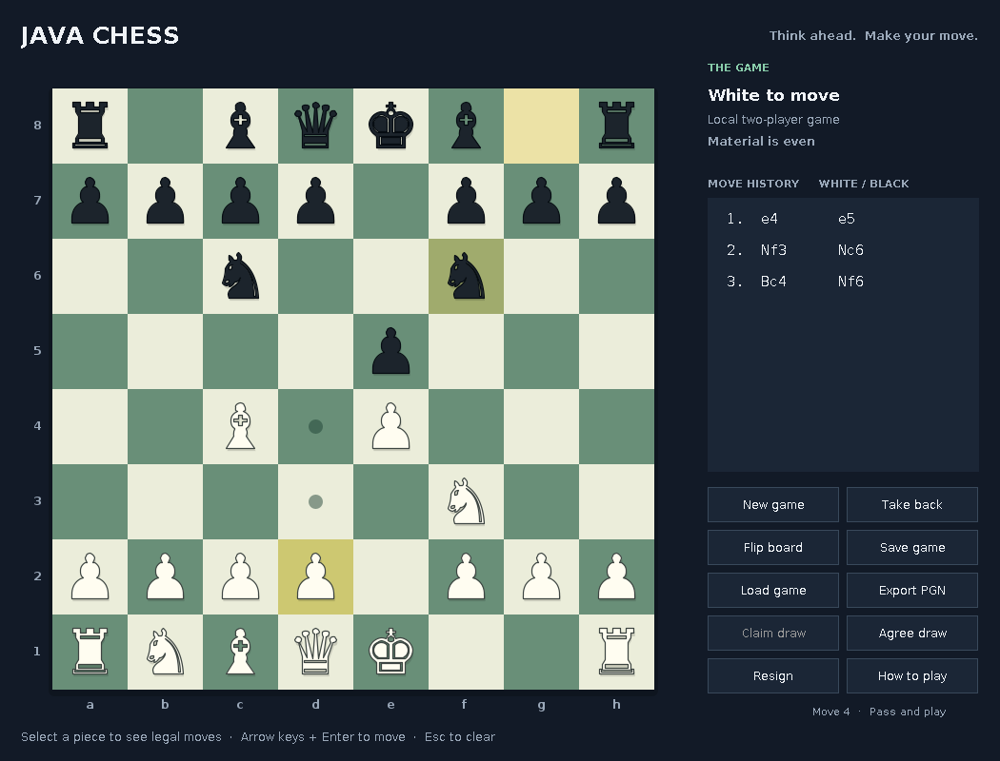

# Java Chess

A playable, untimed Java desktop chess game with **local two-player play** and a **built-in computer opponent**. Built by expanding the original board/tile starter into a separate rules engine, game controller, and Swing interface.



## Run in IntelliJ on Windows

**Recommended setup: IntelliJ IDEA + a JDK 21 download from inside the IDE.** The project targets Java 17 and works on JDK 17 or newer. Swing is included in Java; no graphics library or paid IDE feature is needed.

1. Install [IntelliJ IDEA](https://www.jetbrains.com/idea/download/?section=windows). Its core Java features are free. If you already use IntelliJ, keep that installation.
2. On the welcome screen click **Clone Repository** (older versions: **Get from VCS**). Paste:
   ```text
   https://github.com/Nabeelfarooqi/java-chess.git
   ```
   If IntelliJ asks for Git, use its Download and Install option. Pick a local folder such as `C:\Users\YOUR_NAME\IdeaProjects\java-chess` and click **Clone**.
3. Open/trust the project. If asked which project model to import, choose **Maven** (`pom.xml`). Let indexing and Maven import finish. Maven may download build plugins on first use, but the game itself has no external dependencies.
4. Open **File → Project Structure → Project → SDK → Add SDK → Download JDK**. Choose **21** and **Eclipse Temurin** (or an available OpenJDK distribution). Select the downloaded JDK as the project SDK. The SDK must be a full JDK, not just a JRE.
5. Select the shared **Java Chess** run configuration near the green play button and click **Run**. If it is not listed, open `src/com/chess/ChessApplication.java` and click the green triangle next to `main`.
6. Use **New game** to choose local play or a computer opponent, your color, and Easy/Normal/Hard. The default game is White versus the Normal computer.

**Already cloned it?** Save/commit your local work, then use **Git → Pull** from `origin/main`. If the Maven panel does not appear, right-click `pom.xml` and choose **Add as Maven Project**. Reload Maven after pulling the new build file. Do not create a second project just to import updates.

There is no direct remote control of your installed IDE from this repository. GitHub carries the files; IntelliJ clones/pulls them and runs them on your PC.

Official references: [IntelliJ installation](https://www.jetbrains.com/help/idea/installation-guide.html), [clone a Git repository](https://www.jetbrains.com/help/idea/set-up-a-git-repository.html), [configure a JDK](https://www.jetbrains.com/help/idea/sdk.html).

## Run without an IDE

Install a full JDK 17 or newer and ensure `java -version` works in a fresh terminal. From this repository's root:

| Action | Windows | macOS / Linux | Direct command on either |
| --- | --- | --- | --- |
| Play | `run.bat` | `sh run.sh` | `java Build.java run` |
| Test | `test.bat` | `sh test.sh` | `java Build.java test` |
| Build JAR | `build.bat` | `sh build.sh` | `java Build.java build` |

In PowerShell, prefix batch filenames with `./`, for example `./run.bat`. These commands use only the JDK and work offline. Build output goes into `build/`. Launch the packaged game with:

```text
java -jar build/java-chess.jar
```

Maven is optional for command-line builds: `mvn test` runs the regression runner through the exec plugin, and `mvn package` produces `target/java-chess-1.0.0.jar`. The offline `Build.java` route is the reference build used by CI.

## Playing

- Click a piece to see legal destinations, then click its destination. A dot marks an empty legal square; a ring marks a capture. Arrow keys and Enter/Space also select squares; Escape clears selection.
- White moves first. Checks are highlighted, and moves leaving your king in check are refused.
- Castle by selecting the king and moving it two squares toward the rook.
- En passant is offered only on the immediately following move. Promotion prompts for queen, rook, bishop, or knight.
- **Take back** undoes one move in local play. Against the computer it returns to your previous decision point and cancels an unfinished search.
- **Flip board** changes orientation without changing whose turn it is.
- **Resign** ends the game. **Agree draw** is available in local two-player mode.
- **Claim draw** becomes available for threefold repetition or the 50-move rule, including a claim based on an intended next move. Fivefold repetition and the 75-move rule are automatic; checkmate has precedence.
- **Save game** writes a `.chess` file with the starting position, legal move history, and result. **Load game** replays and validates it. Loading retains your current opponent/color/difficulty settings; use New game first to choose different settings if needed.
- **Export PGN** writes standard move notation and the result for sharing. PGN import is not implemented; resume games with `.chess` files.

## What is implemented

- Legal moves for every piece; king safety, check, checkmate, and stalemate.
- Castling, en passant, and all four promotion choices.
- Threefold/50-move claims, automatic fivefold/75-move draws, and common insufficient-material draws.
- Resizable board, move highlighting, move history in algebraic notation, takebacks, resignation, draw agreement, and board flipping.
- Save/load with legal replay and atomic replacement where the filesystem supports it; PGN export.
- Cancellable background computer search: iterative deepening, alpha-beta pruning, material/position evaluation, and short capture searches.
- Easy/Normal/Hard settings (depth caps 1/3/4 with approximately 0.25/1.2/2.5 second search budgets). These are relative practice levels, not Elo ratings or Stockfish-level strength.
- IntelliJ run configurations, an optional Maven model, offline launch/build scripts, and GitHub Actions checks on Windows/Linux with JDK 17/21.

## Limits and next steps

The Java desktop application is a local practice game; the separate online Rival Room companion is described below. There are no accounts, matchmaking, ratings, chess clocks, network play, opening database, or external engine integration. Common dead-material positions are detected (bare kings, one minor piece, or bishops confined to one square color); arbitrary blocked-position dead draws are not fully solved. Players can agree a draw locally. FEN parsing supports test positions and save replay; it is not a general proof that an arbitrary position is reachable from a legal game.

Useful next additions: clock controls, a UCI/Stockfish adapter, a PGN importer, captured-piece trays, and a separate multiplayer service. Keep rule changes independent of UI code and add position-based regression tests for them.

## Code map / suggested reading order

| File | Responsibility |
| --- | --- |
| `src/com/chess/board/Piece.java` | Piece types, colors, and values. |
| `src/com/chess/board/Tile.java` | The original tile abstraction, now completed and used with real pieces. |
| `src/com/chess/board/Move.java` | Move coordinates, promotions, and UCI notation. |
| `src/com/chess/board/Board.java` | Immutable positions, attacked squares, move generation, and king safety. |
| `src/com/chess/game/ChessGame.java` | History, algebraic notation, results, draw rules, save/load, and PGN export. |
| `src/com/chess/ai/ComputerPlayer.java` | Bounded search that consumes the same legal moves as human play. |
| `src/com/chess/ui/BoardView.java` | Draws pieces and receives board input. |
| `src/com/chess/ui/GamePanel.java` | Connects buttons, the game, and background AI work. |
| `src/com/chess/ChessApplication.java` | Desktop entry point. |
| `test/com/chess/ChessTests.java` | Dependency-free chess and UI regression runner. |
| `Build.java` | Offline compile/test/package launcher. |

## Verification

The regression suite includes starting-position perft through depth 4 (197,281 nodes), Kiwipete through depth 3 (97,862), and two additional special-move/endgame reference positions. It checks illegal moves, pins, castling restrictions/rights, en passant timing and king exposure, underpromotion, mate/stalemate, repetition keys, claimed and automatic draws, SAN, save/load, rejected malformed saves, AI legality/mate finding/cancellation, and Swing interactions.

The initial implementation was compiled and tested on OpenJDK 17 in Linux. The Swing board was rendered and visually inspected offscreen. The local environment did not provide a Windows desktop or IntelliJ session; GitHub Actions adds Windows/JDK coverage, and native window behavior should be checked when you launch locally.

The game uses only Java/Swing and bundled system fonts. The board and screenshot contain no third-party piece images. Original MIT license retained.

## Private online chess: Rival Room

The new [web companion](web/README.md) lets friends play timed chess through a link, with a personal PIN for each player, a rival picker, and individual and head-to-head wins/losses/draws. It includes mouse/touch dragging, castling, a queued premove, live updates, and Stockfish Game Review for finished games. Nabeel’s PIN opens Walan and Usman’s PIN opens Gud, with their own character portraits, room colors, board halves, and kings. Saif retains his own profile; existing PINs and records are retained. It deploys to your own Cloudflare account with Workers, D1, and WebSocket Durable Objects. The desktop Java game above stays available in IntelliJ.

Choose an easier six-digit PIN for any player with `cloudflare:set-pin`, preserving their identity and scores. Optional [BlueBubbles iMessage notifications](web/IMESSAGE_SETUP.md) send challenge links privately to a rival and text results with updated head-to-head records to your selected group through your Mac. Messages use Nabeel for Walan and Usman for Gud. Map Gud to Usman's direct conversation, Saif to Saif's, and choose FRQ for group results during setup. Images and memes are paused. Notifications stay off until configured; the chess site runs independently of the Mac.

If Messages shows those chats but setup cannot find them, run `npm run imessage:chats` from `web/` on your Mac. This read-only diagnostic distinguishes an empty BlueBubbles response from unsupported chat formats, without sending messages or changing your saved destinations. See [chat troubleshooting](web/IMESSAGE_SETUP.md#chats-exist-in-messages-but-setup-cannot-find-them).

The setup wizard and sender also support the native `any` chat identifiers returned by Mac Messages, preserving the chosen conversation instead of rewriting its ID. Search by name or phone/email, verify the participants, and choose the exact chat number; duplicate FRQ groups are kept separate. Updating this Mac helper does not require redeploying Cloudflare.

If multiple FRQ entries have identical members, `npm run imessage:groups` compares their latest-message timestamps and Chat IDs without sending messages or printing message content. Run it in a second Terminal window while setup stays open, then match the intended Chat ID to the setup list.

See [web/README.md](web/README.md) for Cloudflare setup, deployment, PIN management, and verification commands.

Group results rotate through owner-approved win jokes and separate draw phrases for every pairing, while keeping the winner and head-to-head record accurate. Phrase selection stays consistent when a notification is retried.
